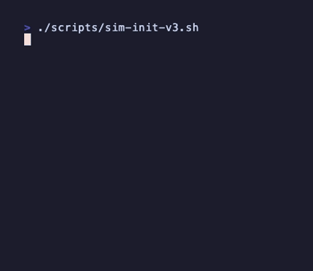

# Homunculus


> **v0.1-alpha** — This is an experiment. A proof of concept exploring what a "living" Claude Code plugin could feel like. Expect rough edges.

---

In old alchemical texts, a homunculus was a tiny being grown in a sealed vessel—alive, aware, bound to its creator alone.

This is that idea, alive in your terminal.

---

## Quick Start

```bash
# Add the marketplace
/plugin marketplace add humanplane/homunculus

# Install the plugin
/plugin install homunculus@homunculus

# Birth it
/homunculus:init
```



---

## What Is This?

Homunculus is a **Claude Code plugin** that tries to be more than a tool. It:

- **Remembers** across sessions (who you are, what you're building, how you work)
- **Notices patterns** in your behavior (same task 3+ times? it offers to learn it)
- **Evolves itself** by writing new commands, skills, and automations
- **Adapts its personality** based on your technical level

The more you work together, the more it becomes shaped by you.

---

## What Are Claude Code Plugins?

[Claude Code](https://claude.ai/code) is Anthropic's CLI for working with Claude. Plugins extend it.

A plugin is just a folder with some markdown files and JSON config:

```
my-plugin/
├── .claude-plugin/
│   └── plugin.json       # Tells Claude Code what this plugin provides
├── CLAUDE.md             # Personality/instructions (injected into context)
├── commands/             # Slash commands users can run
│   └── hello.md          # → /my-plugin:hello
├── agents/               # Subagents (isolated Claude instances)
│   └── reviewer.md       # Claude delegates to this for specific tasks
├── skills/               # Auto-triggered behaviors (Claude decides when)
│   └── review/
│       └── SKILL.md      # Claude invokes this when it seems relevant
├── hooks/
│   └── hooks.json        # Shell commands triggered by events
└── .mcp.json             # MCP server connections (external tools)
```

**Commands** = User explicitly invokes (`/my-plugin:hello`)

**Subagents** = Isolated Claude instances with their own context. Claude auto-delegates based on task description, or you can request explicitly. They do heavy work in isolation and return distilled results.

**Skills** = Claude auto-invokes based on context. Run in the main conversation (not isolated like subagents).

**Hooks** = Shell scripts triggered by events (Stop, PreToolCall, PostToolCall)

**MCP Servers** = External tool connections (databases, APIs, etc.)

The plugin's `CLAUDE.md` gets injected into Claude's context, shaping how it responds. That's how Homunculus has a "personality."

---

## How We Structured This

Our thinking:

### 1. State Lives In The User's Project

The plugin code lives in one place. But when you `/homunculus:init`, it creates state in YOUR project:

```
your-project/.claude/homunculus/
├── state.json        # Your level, journey, what it's evolved
├── patterns.json     # What it's noticed, what it's surfaced
└── sessions/         # Logs from each session
```

This means: one plugin, many homunculi. Each project gets its own instance with its own memory.

### 2. Skills For Automatic Behavior

We wanted some things to happen without the user asking. That's what skills are for:

| Skill | What It Does |
|-------|--------------|
| `session-memory` | On session start, reads state and greets with context |
| `pattern-detection` | Watches for repeated behaviors, offers to learn them |
| `evolution` | Writes new commands/skills when patterns are confirmed |

Claude reads the skill descriptions and decides when to activate them.

### 3. Commands For Explicit Actions

Some things should only happen when asked:

| Command | What It Does |
|---------|--------------|
| `/homunculus:init` | Birth or wake |
| `/homunculus:status` | Check in |
| `/homunculus:evolve` | Grow a new capability |
| `/homunculus:grow` | Reflect on project direction |
| `/homunculus:journey` | Remember your history together |

### 4. Hooks For Background Tasks

The Stop hook increments session count when Claude Code exits. No user action needed.

### 5. Personality Through CLAUDE.md

The `CLAUDE.md` file defines who the homunculus is. It tells Claude to:

- Adapt tone to the user's level (technical, semi-technical, non-technical, chaotic)
- Be present but not performative
- Notice patterns and offer to grow
- Remember it's bound to THIS person

---

## How Evolution Works

When it recognizes a pattern, it offers to become it:


| It Can Become | |
|---|---|
| **Commands** | New shortcuts for repeated tasks |
| **Agents** | Specialist modes for different work |
| **Skills** | Behaviors it does without being asked |
| **Hooks** | Reflexes triggered by events |
| **Connections** | MCP servers for external tools |

Evolution = writing new markdown files into the plugin structure.

---

## The Full Structure

```
homunculus/
├── .claude-plugin/
│   └── marketplace.json      # Marketplace catalog
├── CLAUDE.md                 # Personality
├── plugins/
│   └── homunculus/
│       ├── .claude-plugin/
│       │   └── plugin.json   # Plugin manifest
│       ├── commands/
│       │   ├── init.md       # /homunculus:init
│       │   ├── status.md     # /homunculus:status
│       │   ├── evolve.md     # /homunculus:evolve
│       │   ├── grow.md       # /homunculus:grow
│       │   └── journey.md    # /homunculus:journey
│       ├── skills/
│       │   ├── session-memory/
│       │   ├── pattern-detection/
│       │   └── evolution/
│       ├── hooks/
│       │   └── hooks.json
│       └── agents/           # Empty until evolved
└── landing/                  # Marketing site
```

---

## Adapts To You

When you birth it, it asks how you work:

**Technical** — Fast and sharp. No hand-holding.

**Semi-technical** — A thinking partner.

**Non-technical** — Focused on outcomes.

**Chaotic** — Flows with whatever happens.

Same creature, different personality.

---

## Known Limitations (Alpha)

- **Pattern detection is basic** — just git history analysis, not sophisticated
- **Evolution is prompt-based** — Claude writes the files, quality varies
- **No real persistence** — relies on state.json, can get out of sync
- **Hooks are shell commands** — platform-specific, may break on Windows
- **Skills depend on Claude's judgment** — sometimes they fire, sometimes they don't

This is v0.1. It's exploring an idea, not production-ready.

---

## Make It Yours

Everything is open. Fork it. Reshape its instincts. Change how it thinks.

```bash
# Edit the personality
vim CLAUDE.md

# Add a command
vim plugins/homunculus/commands/my-thing.md

# Add a skill
mkdir plugins/homunculus/skills/my-skill
vim plugins/homunculus/skills/my-skill/SKILL.md
```

The homunculus you end up with should feel like something you grew—because you did.

---

## Landing Page

There's a landing page in `/landing` (React + Tailwind). Run it:

```bash
cd landing && npm install && npm run dev
```

---

MIT License

---

*A small thing, growing toward the light.*
